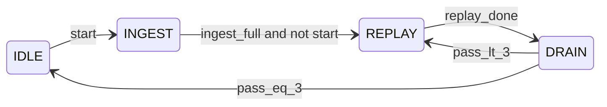
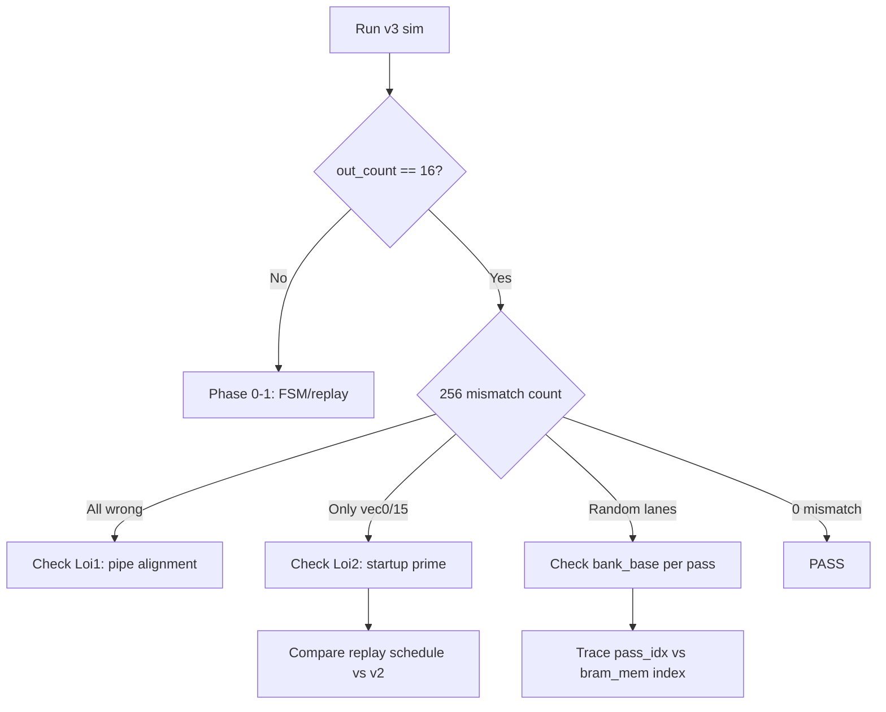

# Plan Debug In_Projection_Unit_Streaming_v3

## Lưu ý về tài liệu tham khảo


| File                                                                                                                               | Nội dung thực tế                                                                        | Vai trò trong plan                                                                       |
| ---------------------------------------------------------------------------------------------------------------------------------- | --------------------------------------------------------------------------------------- | ---------------------------------------------------------------------------------------- |
| `[RTL/code_AI_gen/REAL_DATA_VALIDATION_REPORT.md](RTL/code_AI_gen/REAL_DATA_VALIDATION_REPORT.md)`                                 | Pipeline validate ITMN (Conv/Linear/Scan…) với **real model data**, không mô tả race v2 | Dùng cho **methodology**: extract golden → xsim → compare byte-by-byte, tolerance Q16.12 |
| `[RTL/STREAMING_DESIGN_GUIDE.md](RTL/STREAMING_DESIGN_GUIDE.md)`                                                                   | **Nhật ký debug v2** — 3 lỗi chính + checklist + debug signals                          | **Nguồn chính** map lỗi v2 → v3                                                          |
| `[RTL/code_AI_gen/test_In_Projection_Unit/VALIDATION_SUMMARY.txt](RTL/code_AI_gen/test_In_Projection_Unit/VALIDATION_SUMMARY.txt)` | Bank unpacking đúng 100%, golden provenance có thể lệch ±23                             | Loại trừ giả thuyết sai weight bank                                                      |


---

## Trạng thái hiện tại




| Metric             | v2 (baseline)      | v3 (hiện tại)                                     |
| ------------------ | ------------------ | ------------------------------------------------- |
| Golden compare     | **0/256 mismatch** | **0 output captured** (`rtl_output_v3.mem` trống) |
| Root cause blocker | —                  | Replay block **syntax/logic corrupt** (~L245–263) |
| Trước khi corrupt  | —                  | **27/256 mismatch** (vec 0, vec 15)               |


**Blocker P0** — replay counter block bị vỡ cấu trúc `if/else`:

```245:263:RTL/code_initial/In_Projection_Unit_Streaming_v3.v
        end else if (op_state == S_REPLAY) begin
                replay_hold <= 1'b0;
            end else begin
                replay_started <= 1'b1;
                if (replay_cnt != TOTAL_INPUTS - 1) begin
                    replay_cnt <= replay_cnt + 1;
                    ...
                end
            end
        end else if (op_state == S_DRAIN) begin
```

Hệ quả: thiếu `vld_in <= 1'b1` trong REPLAY → pipeline không chạy → `out_valid` không pulse → TB timeout 12000 cycles.

---

## Phase 0 — Khôi phục chức năng cơ bản (P0)

**Mục tiêu:** Capture được **16 vector / 256 values** (dù chưa match golden).

### 0.1 Sửa replay block

Khôi phục logic tương đương v2 ingest counter, áp dụng cho replay từ `input_buf`:

```verilog
// Target structure (single always block section)
end else if (op_state == S_REPLAY) begin
    if (replay_hold) begin
        replay_hold <= 1'b0;
        vld_in <= 1'b1;
        // Prime cycle: replay_cnt stays 0, duplicate buf[0] (v2 warm-up)
    end else begin
        replay_started <= 1'b1;
        vld_in <= 1'b1;
        if (replay_cnt != TOTAL_INPUTS - 1) begin
            replay_cnt <= replay_cnt + 1;
            // tick_cnt / group_idx advance (same as v2)
        end
    end
end else if (op_state == S_DRAIN) begin
    vld_in <= 1'b0;
end
```

**Verify ngay sau fix:**

```bash
cd RTL/code_AI_gen/test_In_Projection_Unit && bash run_v3.sh
# Expect: "Captured 16 vectors" (not timeout)
```

### 0.2 Smoke signals trong TB (tạm thời)

Thêm `$display` trong `[tb_in_projection_unit_stream_v3.v](RTL/code_AI_gen/test_In_Projection_Unit/tb_in_projection_unit_stream_v3.v)` cho 20 cycle đầu sau `start=0`:

- `op_state`, `pass_idx`, `replay_cnt`, `vld_in`, `vld_pipe[0]`, `out_valid`
- Mục tiêu: confirm FSM đi qua 4 pass REPLAY → DRAIN

---

## Phase 1 — Fix race FSM multi-pass (P0, v3-specific)

**Triệu chứng đã quan sát:** Khi DRAIN→REPLAY (pass mới), `replay_cnt` còn 127 + `replay_started=1` → FSM nhảy DRAIN ngay → pass lẻ (1,3) không replay đủ 128 cycle.

### 1.1 Nguyên nhân

Hai `always @(posedge clk)` block cập nhật cùng lúc:

- FSM block (`[L139–220](RTL/code_initial/In_Projection_Unit_Streaming_v3.v)`) đọc `replay_cnt`, `replay_started`, `replay_hold`
- Replay block (`[L225–264](RTL/code_initial/In_Projection_Unit_Streaming_v3.v)`) cập nhật các signal đó

`pass_replay_guard` (2 cycle) là workaround chưa đủ tin cậy.

### 1.2 Fix đề xuất (chọn 1)

**Option A (khuyến nghị):** Gộp FSM + replay counter vào **một** `always` block — pattern giống v2 (v2 không tách FSM replay).

**Option B:** Giữ 2 block nhưng:

- FSM chỉ check `replay_done` khi `replay_reset` đã hết **và** `pass_replay_guard==0` **và** `replay_started==1` **và** `!replay_hold`
- Thêm `replay_done` wire = `(replay_cnt == TOTAL_INPUTS-1) && !replay_hold && replay_started`
- Reset `replay_started` về 0 trong `replay_reset` cycle (đã có) và **không** set lại cho đến sau prime cycle

### 1.3 Assertion runtime

```verilog
// During S_REPLAY, after guard expires:
assert(replay_cnt <= TOTAL_INPUTS-1) else $error("replay_cnt overflow");
// On pass transition:
assert(pass_idx <= NUM_PASSES-1) else $error("pass_idx overflow");
```

**Pass criteria Phase 1:** Waveform cho thấy mỗi pass có đúng **129 vld cycles** (1 prime + 128 advance) trước khi vào DRAIN.

---

## Phase 2 — Áp dụng checklist streaming v2 → v3 (P1)

Map trực tiếp từ `[STREAMING_DESIGN_GUIDE.md](RTL/STREAMING_DESIGN_GUIDE.md)` §1–§4:

### Lỗi v2 #1: Data-to-Tag Misalignment


| Check v2                               | v3 status         | Action                      |
| -------------------------------------- | ----------------- | --------------------------- |
| Stage0 direct load `st0_x_pipe[0]`     | **OK** — L360–361 | Giữ nguyên                  |
| Stage1 consume `pipe[0]` not `pipe[1]` | **OK** — L386     | Giữ nguyên                  |
| Operand tick = tag tick at Stage1      | Chưa verify       | Thêm trace G0_T0 qua stages |


### Lỗi v2 #2: Startup Bubble (prime bị zero)


| Check v2                        | v3 equivalent       | Action                                                                            |
| ------------------------------- | ------------------- | --------------------------------------------------------------------------------- |
| `x_sub_vec_pipe[0] <= (start    |                     | vld_in) ? ...`                                                                    |
| First sample duplicate at tick0 | `replay_hold` cycle | Đảm bảo prime cycle **không** advance `replay_cnt` nhưng **có** feed `replay_vec` |


Đây là nguyên nhân khả dĩ của **27 mismatch tập trung vec 0 và vec 15** (startup/shutdown boundary).

### Lỗi v2 #3: Stale debug registers

- Dùng `st0_x_pipe[0]`, `grp_idx_pipe[1]`, `tick_cnt_pipe[1]` cho trace — không dùng `st0_x[]` snapshot
- TB đã có `dbg`_* ports — bật trace qua `[trace_helpers.vh](RTL/code_AI_gen/test_In_Projection_Unit/trace_helpers.vh)` nếu cần

---

## Phase 3 — Debug có hệ thống theo framework v2 (P1)

Theo §5–§6 STREAMING_DESIGN_GUIDE:




### 3.1 Single-item trace (watch G=2, T=0)

1. Chạy v2 với cùng `input.mem` + 16 banks → lưu reference trace
2. Chạy v3 pass 0 only (tạm disable pass 1–3) → so `dbg_sat0` tại group 2
3. Script sẵn có: `[trace_lane0_debug.py](RTL/code_AI_gen/test_In_Projection_Unit/trace_lane0_debug.py)`, `[compare_all_256.py](RTL/code_AI_gen/test_In_Projection_Unit/compare_all_256.py)`

### 3.2 Per-pass isolation test

Tạm sửa RTL (debug only):

- Force `NUM_PASSES=1` → verify pass 0 lanes 0–3 match v2 lanes 0–3
- Repeat pass_idx=1,2,3 → verify lanes 4–7, 8–11, 12–15

Nếu từng pass PASS riêng lẻ nhưng full 4-pass FAIL → lỗi ở **merge_out / bank_base timing**.

### 3.3 Merge logic review

```460:469:RTL/code_initial/In_Projection_Unit_Streaming_v3.v
if (en && vld_pipe[6] && tick_cnt_pipe[6] == (TAPS - 1)) begin
    merge_out[grp][bank_base + i] <= stage4_sat_out[i];
    if (pass_idx == NUM_PASSES - 1) begin
        // assemble y_out from merge_out[0..bank_base-1] + fresh lanes
        out_valid <= 1'b1;
```

Checklist:

- `merge_out` được ghi **mọi pass** (pass 0–3), không chỉ pass 3
- `bank_base = pass_idx << 2` khớp BRAM index (0,4,8,12)
- `y_out` assembly copy đủ 16 lane từ `merge_out[grp][0:15]`

---

## Phase 4 — Golden validation (P2)

Theo methodology `[REAL_DATA_VALIDATION_REPORT.md](RTL/code_AI_gen/REAL_DATA_VALIDATION_REPORT.md)`:

```bash
cd RTL/code_AI_gen/test_In_Projection_Unit
bash run_v3.sh          # inline compare, tolerance err > 256
python3 compare_all_256.py   # detailed per-index report
python3 compare_rtl_vs_golden.py  # if exists for v3 output
```

**Baseline regression:**

```bash
bash run.sh   # v2 — must stay 0/256
```

**Acceptance criteria:**

- v3: **0 mismatches** (err ≤ 256) vs `golden_output.mem`
- v2: vẫn PASS (không regression)
- Resource: 32 multiplier (4×8), không wrap v2

---

## Phase 5 — Dọn dẹp và document

- Gỡ debug `$display` / tắt assertions sau PASS
- Cập nhật comment header v3 về replay schedule (129 cycles, 4-pass TMUX)
- (Optional) thêm §v3 vào cuối `[STREAMING_DESIGN_GUIDE.md](RTL/STREAMING_DESIGN_GUIDE.md)` ghi lại lỗi v3-specific (FSM race, replay prime)

---

## Thứ tự thực hiện (tóm tắt)

1. **Fix replay block corrupt** + `vld_in` trong REPLAY → chạy `run_v3.sh` → có 16 vector
2. **Fix FSM race** (gộp block hoặc tighten guard) → 4 pass đều replay đủ
3. **Fix startup prime** `replay_hold || vld_in` trên `x_sub_vec_pipe[0]` → giảm vec0/15 mismatch
4. **Single-pass + single-group trace** vs v2 baseline
5. **Full 256 compare** → target 0 mismatch
6. **Regression v2** + cleanup

---

## Files chính cần sửa


| File                                                                                                                                                     | Thay đổi                                                     |
| -------------------------------------------------------------------------------------------------------------------------------------------------------- | ------------------------------------------------------------ |
| `[RTL/code_initial/In_Projection_Unit_Streaming_v3.v](RTL/code_initial/In_Projection_Unit_Streaming_v3.v)`                                               | Replay block, FSM race, x_sub_vec prime, optional assertions |
| `[RTL/code_AI_gen/test_In_Projection_Unit/tb_in_projection_unit_stream_v3.v](RTL/code_AI_gen/test_In_Projection_Unit/tb_in_projection_unit_stream_v3.v)` | Temporary FSM trace displays                                 |
| `[RTL/code_AI_gen/test_In_Projection_Unit/run_v3.sh](RTL/code_AI_gen/test_In_Projection_Unit/run_v3.sh)`                                                 | Không đổi (đã đủ compare 256)                                |


**Không cần sửa:** weight banks (đã verified), golden extraction pipeline, v2 RTL.

---

## Rủi ro và fallback

- **Golden lệch ±23** (VALIDATION_SUMMARY): nếu còn vài mismatch nhỏ sau fix functional, chạy `comprehensive_bank_validation.py` so RTL vs bank-computed trước khi regenerate golden
- **DRAIN_CYCLES=23**: nếu pipeline depth thay đổi, re-measure latency từ v2 (7 stages + BRAM) và cập nhật `DRAIN_CYCLES`
- Nếu 4-pass TMUX vẫn không đạt 0 mismatch sau Phase 2–3: fallback tạm chạy v3 như **sequential 4× invocation** (mỗi pass reset pipeline) để isolate compute vs scheduling

