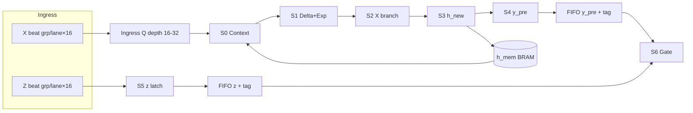

# Plan: SSM Scan Core — Pipeline Streaming (gối đầu đa stage)

## Trạng thái hiện tại (baseline đã có)

| Hạng mục | Trạng thái |
|----------|------------|
| **Phase 1 serial** | **DONE** — `Scan_Core_Streaming.v` + `Scan_Channel_Exec` + 16× `Unified_PE` share FSM |
| **Verify** | PASS N=1/10/1000 — `h_state` tol 48 LSB; `y_gated` vs `gate(rtl_y_pre, silu_z)` |
| **Test folder** | [`RTL/testbench/test_Scancore/`](RTL/testbench/test_Scancore/) (golden chuẩn) |
| **Bottleneck** | ~2500–2800 cy/token vs Conv ~100–200 cy/token; `Scan_Chain_Wrapper` drop beat khi `scan_busy` |
| **Stub chưa dùng** | `Scan_Delta_Engine.v` (chỉ softplus), `Scan_BeatCtx_FIFO.v` (tag only) |

**Quyết định:** Giữ serial RTL làm **golden reference**; refactor sang pipeline mới **không đổi math**.

---

## Bối cảnh upstream (đã chốt)

- [`In_Projection_Unit_Streaming_v2.v`](RTL/code_initial/In_Projection_Unit_Streaming_v2.v): **X0,Z0,X1,Z1,...,X7,Z7** per token.
- [`Conv1D_Layer.v`](RTL/code_initial/Conv1D_Layer.v): `x_act` (MAC+SiLU), `z_act` (SiLU only); ~10 cy/beat X, ~2 cy/beat Z.
- **Không silu nội bộ** trong Scan — `x_act`, `z_act` đã activate từ Conv.
- **Per beat = 16 channel độc lập** — `ch = grp×16 + lane`; không cần đủ 8 grp mới nhân δB/D.

### Toán (per channel `ch` @ token `t`)

```
δ       = softplus(Δ_raw)
discA   = exp(δ ⊙ A)
h_new   = discA ⊙ h_prev + (δ·B) ⊙ x_act
y_pre   = C·h_new + D·x_act
y_out   = y_pre · z_act
```

---

## Kiến trúc mục tiêu: pipeline S0–S6 gối đầu

**Ý tưởng:** Khi grp0 ở S3–S4, grp1 có thể ở S1–S2 — mỗi stage nhận **context mới mỗi cycle** (tag khác).



### Stage map (thay FSM serial 10-step)

| Stage | Công việc | Latency | DSP riêng (khuyến nghị) |
|-------|-----------|---------|-------------------------|
| **S0** | Nạp tag, Δ, x, A, D, B/C token, đọc `h_prev` | 1 cy | 0 |
| **S1** | softplus(δ), δ⊙A, δ⊙B, exp(δ⊙A) | 3 cy | **MUL #1: 16 DSP** |
| **S2** | discA⊙h, δB⊙x, D⊙x | 2 cy | **MUL #2: 16 DSP** |
| **S3** | h_new = add; ghi `h_mem` | 2 cy | 0 (LUT ADD) |
| **S4** | C⊙h_new reduce + D⊙x → `y_pre` | 2 cy | **MUL #3: 16 DSP** |
| **S5** | Latch `z_act` từ beat Z | 1 cy | 0 |
| **S6** | `y_out = y_pre·z_act` merge tag | 1 cy | **16 DSP** (full) hoặc 1 (scalar) |

### DSP budget (3 tiers)

| Tier | DSP | Mô tả | Throughput kỳ vọng |
|------|-----|-------|-------------------|
| **Min overlap** | ~48 | 3× vector MUL 16-lane (S1, S2, S4) | ~1 ch/cy sau warm-up (~140 cy/token) |
| **Balanced** | ~64 | + gate 16-lane S6 | Khớp Conv X beat rate |
| **Production** | **80–96** | + ingress parallel + headroom timing | Full chain không stall |

> Không ép 20–28 DSP rồi stall upstream — ưu tiên **stage compute riêng** thay vì arbiter phức tạp.

### Tag (bắt buộc — STREAMING_DESIGN_GUIDE)

Mỗi pipeline register mang:

```verilog
{ valid, token[15:0], grp[2:0], lane[3:0], ch[6:0] }
+ payload stage-specific
```

- Operand load vào stage register **cùng cycle** với tag.
- Không dùng debug reg stale giữa stage.

### Địa chỉ `h_mem`

```
h_addr = token * 2048 + ch * 16 + state_idx
h_prev @ token t đọc từ token t-1 (serial theo token)
```

BRAM: 2-port hoặc schedule 1R1W; hazard rule: cùng `(token,ch)` không R+W cùng cycle.

---

## Timeline ví dụ (3 channel stagger)

```
Cycle:  0   1   2   3   4   5   6   7   8
Ch0:   S0  S1  S1  S1  S2  S2  S3  S4  S4
Ch1:       S0  S1  S1  S1  S2  S2  S3  S4
Ch2:           S0  S1  S1  S1  S2  S2  S3
```

Ingress: X beat grp=g → enqueue 16 jobs; dispatch **1 ch/cycle** vào S0.

---

## Interface

### Standalone + chain (giữ beat handshake)

```verilog
input  beat_valid, beat_path_x   // path_x=1 → X, 0 → Z
input  [15:0] beat_token
input  [2:0]  beat_grp
input  signed [LANES*16-1:0] beat_vec

output scan_ready    // backpressure upstream
output scan_valid
output signed [LANES*16-1:0] y_out_vec

input  clear_h
// B_row, C_row per token; A, D, delta internal BRAM
```

### Chain wrapper (Phase 2b)

- FIFO depth **16–32** giữa Conv và Scan ingress.
- `scan_ready` → stall `conv_ready` / chain wrapper.
- **Không** `if (!scan_busy)` drop beat.

---

## Phase thực hiện

### Phase 1 — Serial functional ✅ DONE

- RTL: [`Scan_Core_Streaming.v`](RTL/code_initial/Scan_Core_Streaming.v), [`Scan_Channel_Exec.v`](RTL/code_initial/Scan_Channel_Exec.v)
- TB: [`tb_scan_core_streaming.v`](RTL/testbench/test_Scancore/tb_scan_core_streaming.v)
- PASS golden — dùng làm regression khi refactor pipeline.

### Phase 2 — Pipeline RTL (blocking tiếp theo)

**Thứ tự implement:**

1. `Scan_Pipe_Types.vh` — struct tag + stage payloads
2. `Scan_S1_DeltaEngine` … `Scan_S6_Gate` — tách logic từ [`Scan_Core_Engine.v`](RTL/code_initial/Scan_Core_Engine.v)
3. `Scan_Vector_Mul16.v` — wrapper 16× `Unified_PE` hoặc `(* use_dsp *)` array (instantiate 3× cho S1/S2/S4)
4. `Scan_Core_Streaming_Pipe.v` — scheduler + stage chain
5. TB: 2-channel stagger test → full beat order → N=1/10/1000

**Tiêu chí PASS Phase 2:**

- `compare_scan.py`: `h_state` bad=0, max|diff|≤48; `y_gated` bad=0
- Sim throughput: ≤~200 cy/token @ N=1000 (vs ~2750 serial)
- Không deadlock `beat_valid`/`scan_ready`

**Migration:** `Scan_Core_Streaming.v` giữ alias `*_Serial` hoặc parameter `PIPELINE_MODE`; TB chọn qua `+define+SCAN_PIPE=1`.

### Phase 2b — Chain integration

- Sửa [`Scan_Chain_Wrapper.v`](RTL/code_initial/Scan_Chain_Wrapper.v): FIFO + backpressure
- `tb_scan_chain` + `run_chain.sh` trong `test_Scancore/`
- Delta/B/C từ BRAM golden (InProj chưa stream Δ) — giống plan cũ

### Phase 3 — Synthesis OOC

- Top: `Scan_Core_Streaming_Pipe_ooc_top.v`
- XDC 100 MHz → Fmax search
- Báo cáo: `KLTN1/synth_utilization_scan_pipe.txt`, `synth_timing_scan_pipe.txt`
- Target: **48–96 DSP**, WNS ≥ 0 @ 100 MHz

---

## File RTL dự kiến

| File | Vai trò |
|------|---------|
| `Scan_Pipe_Types.vh` | Tag + stage bundle typedefs |
| `Scan_S0_Ingress.v` | Beat → channel job queue |
| `Scan_S1_DeltaEngine.v` | P0–P1 delta branch |
| `Scan_S2_XBranch.v` | discA·h, δB·x, D·x |
| `Scan_S3_StateUpdate.v` | h_new + BRAM write |
| `Scan_S4_YPre.v` | C·h + D·x reduce |
| `Scan_S5_ZLatch.v` | z_act FIFO in |
| `Scan_S6_Gate.v` | FIFO merge + gate |
| `Scan_Vector_Mul16.v` | Shared 16-lane MUL cell |
| `Scan_Core_Streaming_Pipe.v` | Top pipeline |
| `Scan_YPre_Tag_FIFO.v` | (y_pre, token, ch) depth 8 |
| `Scan_Z_Tag_FIFO.v` | (z_act, token, ch) depth 8 |

Tái sử dụng: [`Scan_YPre_Slot.v`](RTL/code_initial/Scan_YPre_Slot.v), [`Softplus_Unit_PWL.v`](RTL/code_initial/Softplus_Unit_PWL.v), [`Exp_Unit.v`](RTL/code_initial/Exp_Unit.v), saturate/reduce từ `Scan_Core_Engine`.

---

## Rủi ro & mitigation

| Rủi ro | Mitigation |
|--------|------------|
| Tag misalignment | Checklist [`STREAMING_DESIGN_GUIDE.md`](RTL/STREAMING_DESIGN_GUIDE.md); trace per-stage |
| h_mem hazard | Unit test 2 token; explicit R/W schedule |
| FIFO y/z mismatch | Depth 8; merge chỉ khi tag khớp |
| Pipeline ≠ serial golden | So sánh song song N=1 trước N=1000 |
| Chain stall | `scan_ready` + FIFO; đo fill level trong sim |

---

## So sánh plan cũ → plan mới

| | Plan cũ (serial Phase 1) | Plan mới (pipeline) |
|---|---------------------------|---------------------|
| Compute | 1×16 PE, FSM tuần tự | 3–4×16 PE, stage song song |
| DSP | ~16–20 | **48–96** (có thể tăng) |
| Throughput | ~1 ch / ~20–30 cy | ~1 ch / 1 cy (sau warm-up) |
| Chain | Drop beat khi busy | FIFO + backpressure |
| Verify | ✅ PASS | Regression vs serial golden |

---

## Lệnh verify (giữ nguyên)

```bash
cd RTL/testbench/test_Scancore
./run.sh 1|10|1000
# Sau pipeline:
SCAN_PIPE=1 ./run.sh 1
```
